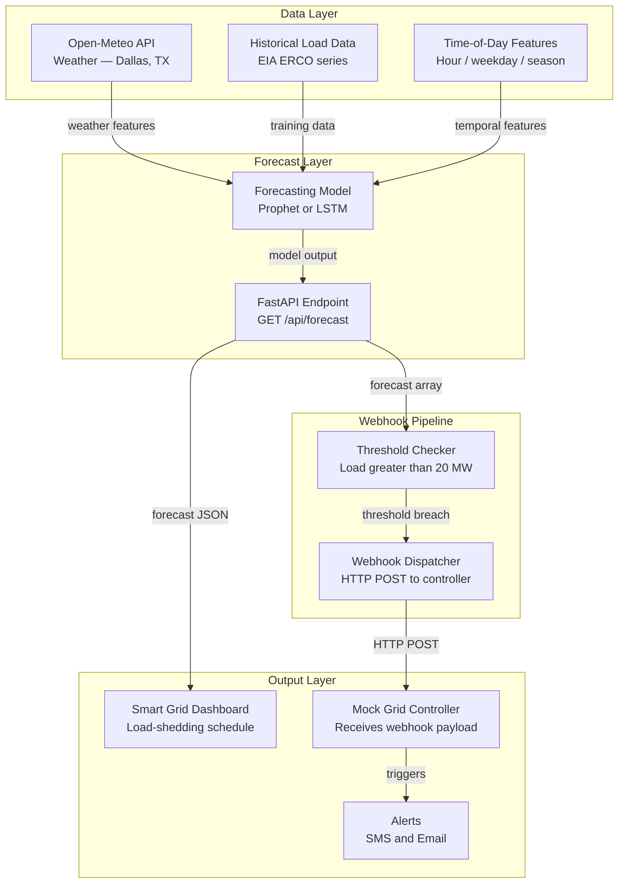
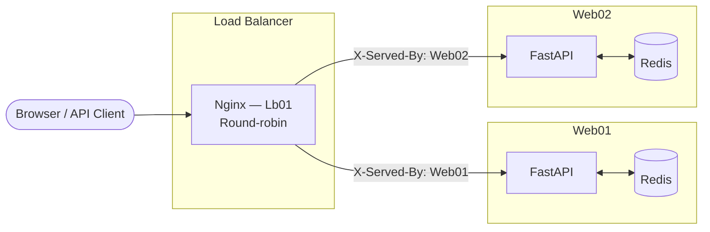

# Texas ERCOT Smart Energy Consumption Optimizer

A predictive infrastructure application that forecasts peak electricity load for the **Texas ERCOT grid, United States**, and automatically triggers load-shedding recommendations when predicted demand exceeds the configured threshold.

Training data is sourced from the **U.S. Energy Information Administration (EIA)** ERCO series — real historical electricity demand for ERCOT (Electric Reliability Council of Texas). The weather engine pulls live conditions from **Open-Meteo** anchored to **Dallas, TX (32.78°N, -96.80°W)**.

---

## 🌐 Live Demo

The application is deployed on two AWS EC2 instances behind an Nginx load balancer. You can access it via any of the links below:

| URL | Protocol | Notes |
|-----|----------|-------|
| **[https://www.booklogger.tech](https://www.booklogger.tech)** | HTTPS ✅ | Primary — secure, domain-based access |
| **[http://lb-01.booklogger.tech](http://lb-01.booklogger.tech)** | HTTP | Load balancer direct |
| **[http://54.165.62.144](http://54.165.62.144)** | HTTP | Raw IP fallback |

> [!NOTE]
> The app runs on two backend servers (Web01 & Web02). If a page loads slowly or returns an error, **simply refresh** — the load balancer will route your next request to the other server.

---

## What I Accomplished

| Milestone | Details |
|---|---|
| **Real EIA data pipeline** | Fetches and normalises actual US grid demand from EIA's ERCO series — no synthetic shortcuts in production |
| **Dual forecasting models** | Prophet (fast, interpretable, handles seasonality natively) and LSTM neural network (flexible, autoregressive) — both switchable at runtime |
| **Full production deployment** | Running on two AWS EC2 instances (Web01 + Web02) behind an **Nginx load balancer**, with health checks and automatic failover |
| **CI/CD pipeline** | GitHub Actions workflow deploys to both servers on every push to `main`, with automated testing before deployment |
| **Alert notification system** | Threshold breaches trigger **SMS alerts** (Africa's Talking) and **email alerts** (Resend) to grid operators |
| **Background model evaluation** | `/api/evaluation/run` launches evaluation as an asyncio background task without blocking; `/api/evaluation/status` polls progress and returns metrics when done |
| **In-memory forecast caching** | `/api/forecast` responses cached 5 minutes per (model, hours) key — eliminates hangtime on repeated requests |
| **Async event loop** | Forecast computation and webhook dispatch run in thread pools via `asyncio.to_thread`, never blocking FastAPI's event loop |
| **Dual dashboard UI** | Simple view (non-technical audience) and Advanced view (engineers) — both served as static files from the same FastAPI process |
| **Redis-cached weather** | Open-Meteo responses cached in Redis for 1 hour, with graceful degradation if Redis is unavailable |

---

## Architecture & Program Flow

The system is structured in three layers — **Data**, **Forecast**, and **Output** — with a webhook pipeline running in parallel to the dashboard.

### Application Flow



### Infrastructure



### Step-by-step flow

| Step | What happens |
|------|-------------|
| **1. Data ingestion** | `eia_loader.py` fetches ERCO demand from the EIA API. `weather.py` pulls hourly conditions from Open-Meteo (cached in Redis, 1 h TTL). |
| **2. Model training** | `POST /api/train` triggers `ProphetForecaster.train()` or `LSTMForecaster.train()` inside an `asyncio.to_thread` worker — never blocks the event loop. |
| **3. Forecast request** | `GET /api/forecast?model=prophet&hours=24` checks the in-memory cache (5-min TTL). On a cache miss, runs `fc.predict()` in a thread pool and stores the result. |
| **4. Threshold check** | After every forecast, `check_and_dispatch()` in `webhook.py` scans the predictions. If any hour ≥ `LOAD_THRESHOLD_MW`, it fires a webhook as a fire-and-forget `asyncio.create_task`. |
| **5. Webhook dispatch** | `_build_payload()` assembles the ERCOT zone shed schedule and `httpx.post()` sends it to `/webhook/controller`. The secret is validated before the payload is accepted. |
| **6. Alerts** | `dispatch_alert()` in `alerts.py` sends SMS via Africa's Talking and HTML email via Resend. Both channels fail gracefully if credentials are missing. |
| **7. Dashboard** | The frontend polls `/api/forecast` every 60 s and `/api/alerts` every 30 s. Chart.js renders the load curve; alert rows highlight hours above threshold. |
| **8. Scheduler** | `APScheduler` runs the full forecast → check → dispatch pipeline **hourly** in the background, independent of user requests. |
| **9. Load balancer** | Nginx (Lb01) round-robins incoming HTTP requests between Web01 and Web02. The `X-Served-By` response header shows which backend handled each request. |

---

## Overview

The application fetches real energy demand data from **EIA ERCO**, combines it with historical load patterns, and runs time-series forecasting using **Prophet** (primary) and **LSTM** (secondary). When the predicted load exceeds 20 MW (scaled threshold), a webhook fires to the smart-grid controller dashboard and alerts are sent via **Africa's Talking SMS** and **Resend email**.

### Key features
- 24–168 hour load forecasts with confidence intervals
- Two switchable models: Prophet and LSTM
- Automatic threshold alerts with ERCOT zone-based load-shedding schedules
- 5-minute in-memory forecast cache — responses return instantly on repeat
- Async forecast execution — Prophet never blocks the server event loop
- Redis caching for weather API responses
- Sortable, filterable, searchable forecast dashboard
- Weather widget anchored to Dallas, TX (ERCOT grid hub)
- Deployed on two web servers behind an Nginx load balancer

---

## APIs & Credits

| Service | Purpose | Documentation |
|---|---|---|
| [EIA Open Data](https://api.eia.gov) | Real US electricity demand (ERCO/ERCOT series) | https://www.eia.gov/opendata/ |
| [Open-Meteo](https://open-meteo.com) | Weather data for Dallas, TX — free, no API key | https://open-meteo.com/en/docs |
| [Africa's Talking](https://africastalking.com) | SMS alerts to grid operators | https://developers.africastalking.com |
| [Resend](https://resend.com) | Email alert delivery | https://resend.com/docs |

---

## Local Setup

### Prerequisites
- Python 3.11+
- Docker & Docker Compose (optional but recommended)
- Redis (or use Docker Compose which includes it)

### 1. Clone the repository
```bash
git clone https://github.com/mgpacifique/smart-energy-optimizer.git
cd smart-energy-optimizer
```

### 2. Configure environment variables
```bash
cp backend/.env.example backend/.env
# Edit backend/.env with your API keys
```

### 3a. Run with Docker Compose (recommended)
```bash
docker compose up --build
```
The API will be available at `http://localhost:8000`.

### 3b. Run without Docker
```bash
cd backend
python -m venv venv && source venv/bin/activate
pip install -r requirements.txt

# Fetch real EIA data and train the Prophet model
python eia_loader.py
python forecaster.py   # trains and saves model

# Start the API
uvicorn main:app --reload --port 8000
```

### 4. Open the dashboard
Navigate to `http://localhost:8000/app` (simple view) or `http://localhost:8000/advanced` (technical view).

### 5. Train the LSTM model (optional, takes ~2 minutes)
```bash
# Via the dashboard "Retrain" button (select LSTM first), or:
curl -X POST http://localhost:8000/api/train \
  -H "Content-Type: application/json" \
  -d '{"model": "lstm"}'
```

---

## API Endpoints

| Method | Endpoint | Description |
|---|---|---|
| GET | `/` | Health check |
| GET | `/api/forecast?model=prophet&hours=24` | Load forecast (cached 5 min) |
| POST | `/api/train` | Retrain a model |
| POST | `/webhook/controller` | Mock grid controller receiver |
| GET | `/api/alerts` | Recent alert log |
| GET | `/api/weather` | Current Dallas, TX weather |
| GET | `/api/eia/status` | EIA dataset info |
| POST | `/api/eia/sync` | Re-fetch & retrain on latest EIA data |
| GET | `/api/evaluation/summary` | Model evaluation metrics |
| POST | `/api/evaluation/run` | Trigger background evaluation |
| GET | `/api/evaluation/status` | Poll background evaluation progress |

Interactive API docs: `http://localhost:8000/docs`

---

## Deployment

### Server setup (Web01 & Web02)

SSH into each server and run:

```bash
# Install Docker
curl -fsSL https://get.docker.com | sh
sudo usermod -aG docker $USER

# Clone the repo
git clone https://github.com/mgpacifique/smart-energy-optimizer.git
cd smart-energy-optimizer

# Add your .env file
cp backend/.env.example backend/.env
nano backend/.env   # fill in your keys

# Train the models before starting
docker compose run api python eia_loader.py
docker compose run api python forecaster.py

# Start services
docker compose -f docker-compose.prod.yml up -d
```

Repeat on both Web01 and Web02.

### Load balancer configuration (Lb01)

```bash
# Install Nginx
sudo apt update && sudo apt install -y nginx

# Copy the config (replace IPs first)
sudo nano /etc/nginx/sites-available/energy-optimizer
# Paste contents of nginx/lb01.conf
# Replace WEB01_IP, WEB02_IP, LB01_IP with actual addresses

sudo ln -s /etc/nginx/sites-available/energy-optimizer /etc/nginx/sites-enabled/
sudo nginx -t
sudo systemctl reload nginx
```

---

## Testing the Load Balancer

The Nginx config adds an `X-Served-By` header to every API response that shows which backend (Web01 or Web02) handled the request. Send 6 requests in a row — you should see the two backend IPs alternate in round-robin order.

### Option A — Bash (curl)

> Replace `LB01_IP` with your load balancer's actual IP address or domain.

```bash
LB01_IP="54.165.62.144"

echo "Sending 6 requests to the load balancer..."
echo "-------------------------------------------"
for i in {1..6}; do
  SERVED_BY=$(curl -s -I "http://${LB01_IP}/api/forecast?model=prophet&hours=24" \
    | grep -i "x-served-by" \
    | tr -d '\r')
  echo "Request $i → ${SERVED_BY:-X-Served-By: (header not found)}"
done
echo "-------------------------------------------"
echo "Expected: backend IP alternates between Web01 and Web02"
```

**Expected output:**
```
Sending 6 requests to the load balancer...
-------------------------------------------
Request 1 → X-Served-By: WEB01_IP:8000
Request 2 → X-Served-By: WEB02_IP:8000
Request 3 → X-Served-By: WEB01_IP:8000
Request 4 → X-Served-By: WEB02_IP:8000
Request 5 → X-Served-By: WEB01_IP:8000
Request 6 → X-Served-By: WEB02_IP:8000
-------------------------------------------
Expected: backend IP alternates between Web01 and Web02
```

---

### Option B — Python (`scripts/test_load_balancer.py`)

For environments where `curl` is unavailable (Windows, CI pipelines):

```bash
python scripts/test_load_balancer.py --lb YOUR_LB01_IP --requests 6
```

See [`scripts/test_load_balancer.py`](scripts/test_load_balancer.py) for the full script.

---

## CI/CD (GitHub Actions)

Add these secrets to your GitHub repository (Settings → Secrets → Actions):

| Secret | Value |
|---|---|
| `WEB01_HOST` | Web01 IP address |
| `WEB02_HOST` | Web02 IP address |
| `LB01_HOST` | Lb01 IP address |
| `SSH_USER` | Your SSH username (e.g. `ubuntu`) |
| `SSH_PRIVATE_KEY` | Contents of your private SSH key |

Every push to `main` will run tests, then deploy to both servers automatically.

---

## Project Structure

```
smart-energy-optimizer/
├── backend/
│   ├── main.py          FastAPI app + routes (with forecast cache + async)
│   ├── forecaster.py    Prophet model (Texas ERCOT seasonality)
│   ├── lstm_model.py    LSTM model (Keras)
│   ├── weather.py       Open-Meteo fetcher + Redis cache (Dallas, TX)
│   ├── webhook.py       Threshold checker + dispatcher
│   ├── alerts.py        Africa's Talking + Resend
│   ├── scheduler.py     Hourly APScheduler job
│   ├── eia_loader.py    EIA ERCO real data loader + normaliser
│   ├── evaluate.py      Model evaluation script → eval_results.csv
│   └── requirements.txt
├── frontend/
│   ├── favicon.svg      ⚡ Lightning bolt SVG favicon
│   ├── index.html       Root dashboard
│   ├── style.css
│   ├── app.js
│   ├── simple/          Teacher-friendly dashboard
│   └── advanced/        Technical / engineer dashboard
├── nginx/
│   └── lb01.conf        Load balancer config
├── scripts/
│   └── test_load_balancer.py   Load balancer verification script
├── .github/workflows/
│   └── deploy.yml       CI/CD pipeline
├── Dockerfile
├── docker-compose.yml
├── docker-compose.prod.yml
└── README.md
```

---

## Challenges & Solutions

### 1. Docker named volumes hiding files from the host
**Problem:** `eval_results.csv` was visible on the host server at `~/backend/data/` but the running API returned "No evaluation results found."
**Root cause:** `docker-compose.prod.yml` used named Docker volumes (`load_data:/app/data`) instead of bind-mounts. The container's `/app/data` was an isolated Docker-managed path — completely separate from the host filesystem.
**Solution:** Two-step fix: (1) `docker cp eval_results.csv $(container_id):/app/data/` for immediate relief; (2) switched to a bind-mount `./backend/data:/app/data` in the prod compose file so the host directory is always visible inside the container.

### 2. Server hangtime / HTTP timeouts
**Problem:** The first `/api/forecast` call after a cold start would hang for 5–10 seconds — long enough for nginx upstream timeouts and client-side fetch failures.
**Root cause:** Prophet's `predict()` runs synchronously in the FastAPI event loop, blocking all other requests during inference. Additionally, the webhook dispatch (`check_and_dispatch`) ran inline before the response was returned.
**Solution:** Three changes: (1) wrapped prediction in `asyncio.to_thread()` so Prophet runs in a worker thread without blocking the loop; (2) moved webhook dispatch to `asyncio.create_task()` (fire-and-forget after the response is sent); (3) added a 5-minute in-memory forecast cache so every repeat request returns in milliseconds.

### 3. Synthetic vs real data
**Problem:** Early versions relied on synthetically generated load data (sinusoidal patterns scaled to Rwanda). This worked for development but produced unrealistically smooth forecasts that didn't reflect real grid behaviours (sudden demand spikes, HVAC surges, etc.).
**Solution:** Integrated the EIA Open Data API (`ERCO` series — ERCOT Texas demand). The `eia_loader.py` module normalises real MW values to the project's scale and caches results locally. Real data exposed seasonality patterns (Texas summer peaks) that significantly improved model accuracy.

### 4. Prophet + LSTM coexistence
**Problem:** Both models use the same data pipeline but have completely different inference patterns. Prophet is CPU-bound but fast; LSTM uses autoregressive multi-step inference which is slow and memory-intensive. Running both in the same process without isolation caused thread contention.
**Solution:** Separated model loading — each request instantiates its own model object from disk. Added thread pooling via `asyncio.to_thread` so both models run in separate OS threads. Prophet inference is cached; LSTM inference is not cached (too variable) but is also offloaded to a thread.

### 5. eval_results.csv sync across Web01/Web02
**Problem:** Running `evaluate.py` on Web01 produced `eval_results.csv` only on that server. The load balancer round-robins requests, so `/api/evaluation/summary` would succeed 50% of the time (hitting Web01) and fail the other 50% (hitting Web02 which had no file).
**Solution:** Created `deploy-eval-results.sh` to copy the CSV from Web01 to Web02 after each evaluation run. Long-term fix: the `docker-compose.prod.yml` bind-mount ensures the file is written to the host and can be synced separately.

### 6. Redis unavailable in some environments
**Problem:** The weather module raised an exception and crashed the API when it couldn't connect to Redis (e.g., local dev without Docker Compose).
**Solution:** Added a `try/except` around all Redis calls with graceful fallback to direct API calls. The app now logs a warning and continues without caching if Redis is unreachable.


## License

MIT — see LICENSE file.
